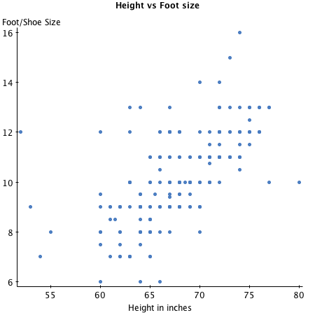
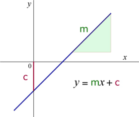
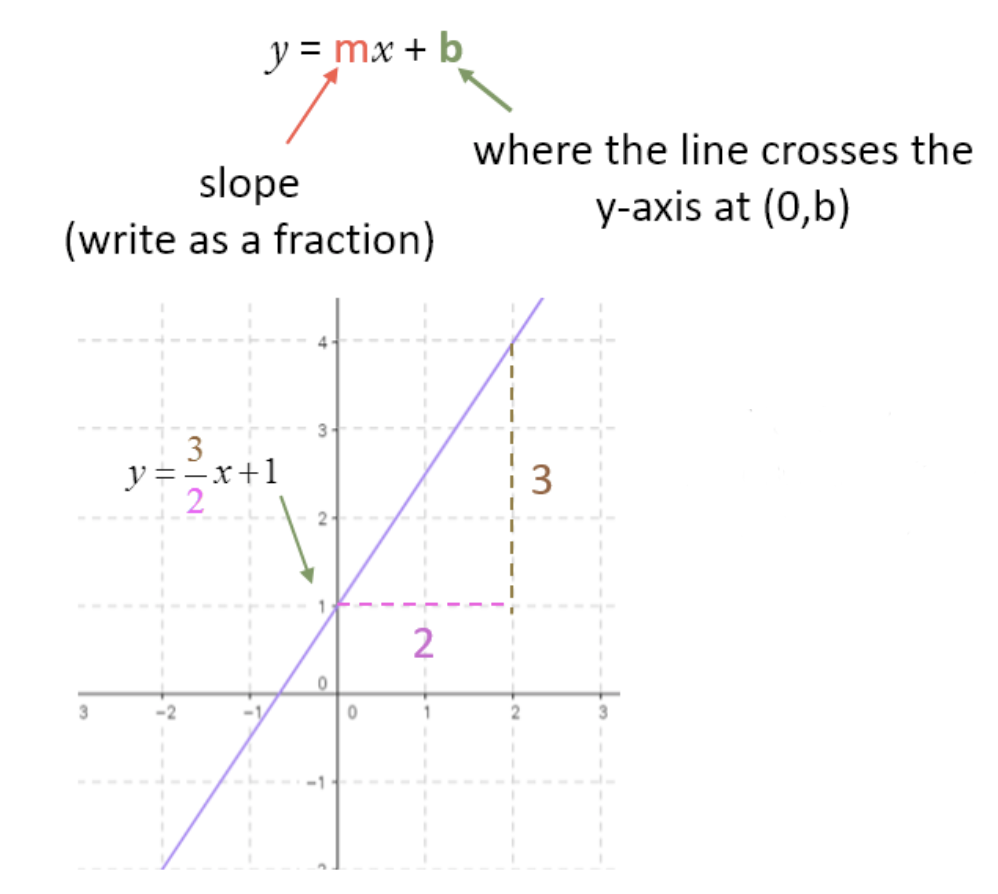

# Introduction to Simple Linear Regression 

## Introduction
Regression analysis is usually the first real "learning" algorithm that aspiring data scientists will come across. It is one of the simplest algorithms to master, however,  still requires some mathematical and statistical understanding of the underlying regression process. This lesson will introduce you to regression process based on the statistical ideas we have discovered so far. 

## Objectives
You will be able to:

* Describe statistical modeling with simple regression 
* Explain simple linear regression analysis as solving for straight line equation: $y=mx+c$
* Calculate the slope and y-intercept given a set of data points
* Calculate a regression line based on calculated slope and intercept
* Predict a target value for a previously unseen input feature, based on model coefficients

## Linear regression

So far, we have covered topics like basic hypothesis testing using z-scores, variable relationships with correlation and covariance etc. In this section, we shall further build upon these ideas to explain the process of regression analysis. 

Regression analysis is one of the most important statistical techniques for business applications. It’s a statistical methodology that helps estimate the strength and direction of the relationship between two (or more variables). Regression results show whether this relationship is valid or not. It also also, helps __predict__ an unknown value based on the derived relationship.

> Regression Analysis is a __parametric__ technique used to **predict** the value of an unknown target variable $Y$ based on one or more of known input features as variable $X$. 

The factor that is being predicted (the factor that the equation solves for) is called the __dependent variable__. The factors that are used to predict the value of the dependent variable are called the __independent variables__.
 For example, height of a human being and his foot size are generally correlated variables as seen in the scatter plot below. Taller persons, by in large tend to have a bigger foot/shoe size.

The linear regression analyses can predict foot size (dependent variable), given height (independent variable) of an individual. Regression is proven to give credible results if the data follows standard parametric assumptions like normality, linearity etc. These will be covered in upcoming lessons in detail. In general, regression analysis helps us in data analytics in following ways:

* Finding an association, relationship between variables.
* Identifying which variables contribute more towards the outcomes.
* **Prediction** of future observations. 

### Why is it called "linear" regression?

As we saw in previous lesson, the term **Linear** implies that the model functions along a straight (or nearly straight) line. **Linearity**, one of the assumptions of this approach, suggests that the relationship between dependent and independent variable can be expressed in a straight line. 

**Simple Linear Regression** uses a single feature (the independent variable) to model a linear relationship with a target (the dependent variable) by fitting an optimal model (i.e. the best straight line) to describe this relationship.  

**Multiple Linear Regression**, which we shall look into detail in the following section, uses more than one features to predict a target variable by fitting a best linear relationship. 

In this section, we shall mainly focus on simple regression to build a sound understanding. For the example shown above i.e. height vs foot size , a simple linear regression model would fit a line to the data points as shown below:

This line can then be used to describe the data and conduct further experiments using this fitted model. So let's move on and see how to calculate such a line in a simple linear regression context 

## Calculating Regression Coefficients: Slope and Intercepts

As we all know from elementary geometry that equation of a straight line can be written as:

$$y=mx+c$$

Following what we have covered so far, we can say from the equation that:

* $y$ is the dependent variable i.e. the variable that needs to be estimated and predicted.
* $x$ is the independent variable i.e. the variable that is controllable. It is the input.
* $m$ is the slope. It determines what will be the angle of the line. It is the parameter denoted as β.
* $c$ is the intercept. A constant that determines the value of y when x is 0.

>__Slope__ and __Intercept__ are called the coefficients of a linear regression model. Calculating the regression model simply involves calculation of these two values. 

__Linear regression is nothing but a manifestation of this simple equation. The formula for the **best-fit** line (or regression line) is still "a Line".__ So this is as complicated as our model can get. The equation here is the same one used to find a line in algebra, but in statistics the points don’t lie perfectly on a line.  
>The real challenge for regression analysis is to fit a line, out of an infinite number of lines that best describes that data.

Consider the line below to see how we calculate slope and intercept.

- The __Slope (m)__ of a line is the **change in Y over the change in X**. 

For example, a slope of 3/2 means as the x-value increases by 2 units, the y-value moves by 3 units on average.

- The __y-intercept (b)__ is the value on the y-axis **where the line crosses the axis**. 

For example, in the equation above $y= \frac{3}{2}x +1$, the line crosses the y-axis at the value $b = 1$, with slope 3/2. The coordinates of intercept point would be $(0, 1)$.

> When a line crosses the y-axis i.e. at the intercept,  the x-value is always 0.

You may be thinking that you have to try lots and lots of different lines to see which one fits best. Fortunately, this task is not as complicated as in may seem . Given some data points, the best-fit line always has a distinct slope and y-intercept that can be calculated using simple linear algebraic approaches. Let's quickly visit the required formulas.

### Best-Fit Line Ingredients

Before we calculate the best-fit line, we have to make sure that we have calculated following measures for variables X and Y:

* The mean of the X $(\bar{X})$

* The mean of the Y $(\bar{Y})$

* The standard deviation of the X values $(S_X)$

* The standard deviation of the y values $(S_Y)$

* The correlation between X and Y ($r$ - Pearson Correlation)

## Calculating Slope  

With above ingredients in hand, we can calculate the slope (shown as $b$ below) of the best-fit line, using the formula:

$$b = r\frac{S_Y}{S_X}$$

This formula has been taken from statistics (the __Least Squares Method__). 

*[Visit this Wikipedia link](https://en.wikipedia.org/wiki/Simple_linear_regression#Fitting_the_regression_line) to get take a look into the maths behind derivation of this formula*

The slope of the best-fit line can be a negative number following a negative correlation.  For example, if an increase in police officers is related to a decrease in the number of crimes in a linear fashion, the correlation and hence the slope of the best-fitting line is negative in this case.

## Calculating Intercept

So now that we have the slope value (b above), we can put it back into our formula $(y=mx+c)$ to calculate intercept (shown as a below). 

$$\bar{Y} = a+ b\bar{X}$$
$$a= \bar{Y} - b\bar{X}$$

$\bar{X}$ and $\bar{Y}$ are the mean values for variables X and Y.  So, in order to calculate the y-intercept of the best-fit line, we start by finding the slope of the best-fit line using the above formula. Then to find the y-intercept, we multiply slope value by mean of x and subtract the result from mean of y. 

**Note:** *Above notation $Y=a+ bX$, as opposed to $y=mx+c$ is a standard way to represent that line under discussion is a __regression line__ *. Here slope m = b and intercept c = a. 

## Predicting from the model

Once we have a regression line with defined parameters slope and intercept as calculated above, we can easily predict the $\hat{Y}$ (target) value for a new $X$ (feature) value using the parameter values:

$$\hat{Y} = bX +a$$

Remember that the difference between Y (in slope and intercept calculation) and $\hat{Y}$ is that $\hat{Y}$ is the $Y$ value predicted by the fitted model, whereas $Y$ carries actual values of variable (called the truth values) that were used to calculated the best fit. 

Next we shall move on and try to code these equations in to draw regression line to a simple dataset to see all of this in action. 

## Additional Reading 

Visit following series of blogs by Bernadette Low for details on topics covered in this lesson.

- [Super Simple Machine Learning — Simple Linear Regression Part 1](https://towardsdatascience.com/super-simple-machine-learning-by-me-simple-linear-regression-part-1-concept-and-r-4b5b39bbdb5d)
- [Super Simple Machine Learning — Simple Linear Regression Part 2](https://towardsdatascience.com/super-simple-machine-learning-simple-linear-regression-part-2-math-and-python-1137acb4c352)

## Summary 

In this lesson, we learnt the basics of simple linear regression between two variables as a problem of fitting a straight line to best describe the data associations on a 2-dimensional plane. Remember this is only half the process. Once we have coded these equations as functions, we shall move on to calculating the loss in our model. 
